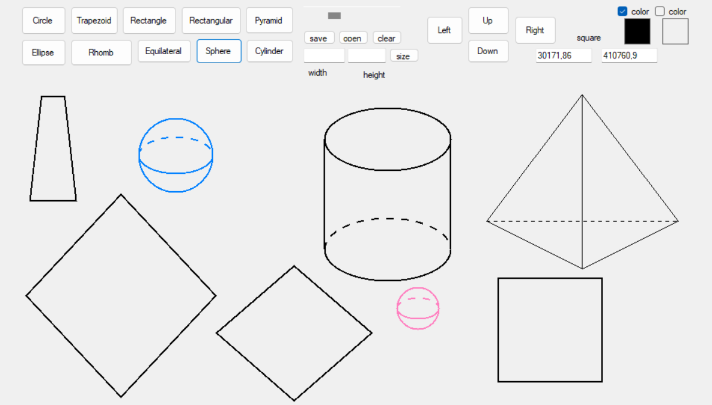

Figures Drawing Application is a Windows Forms project written in C#. The program allows users to create, display, manipulate, resize, move, and save various 2D and 3D geometric figures.
The application demonstrates object-oriented programming principles such as:

-Abstraction
-Inheritance
-Polymorphism
-Encapsulation

All figures are implemented through a base abstract class Figure, with specialized subclasses for 2D and 3D shapes.

Supported 2D Figures
-Rectangle
-Trapezoid
-Rhombus
-Circle
-Ellipse
-Rectangular Triangle
-Equilateral Triangle

Supported 3D Figures (Surface Area Calculation)

-Pyramid
-Sphere
-Cylinder

Functionality
-Create random figures with random size and position
-Select figures with the mouse
-Drag and move figures
-Resize figures manually
-Scale all figures using a scrollbar
-Change border color
-Enable/disable fill color
Calculate area of:
A selected figure
All figures combined
-Save figures to a binary file
-Load figures from a binary file
-Clear all figures from the form

